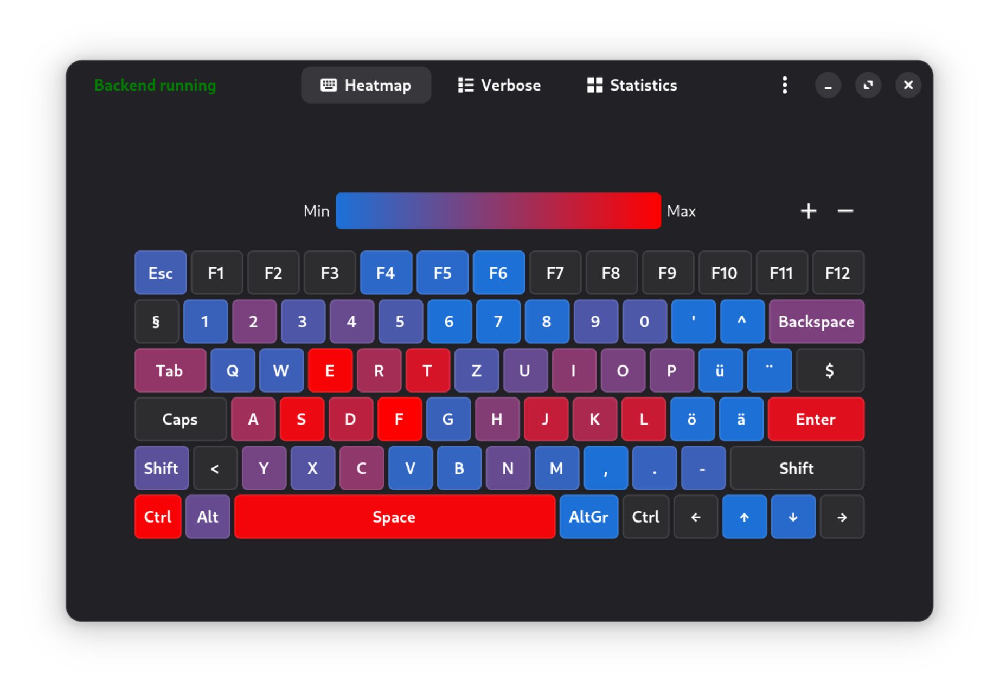
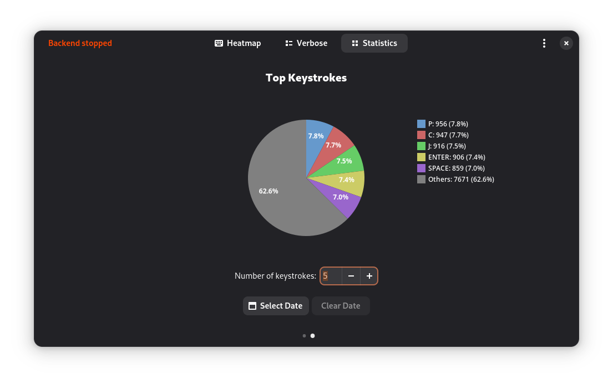
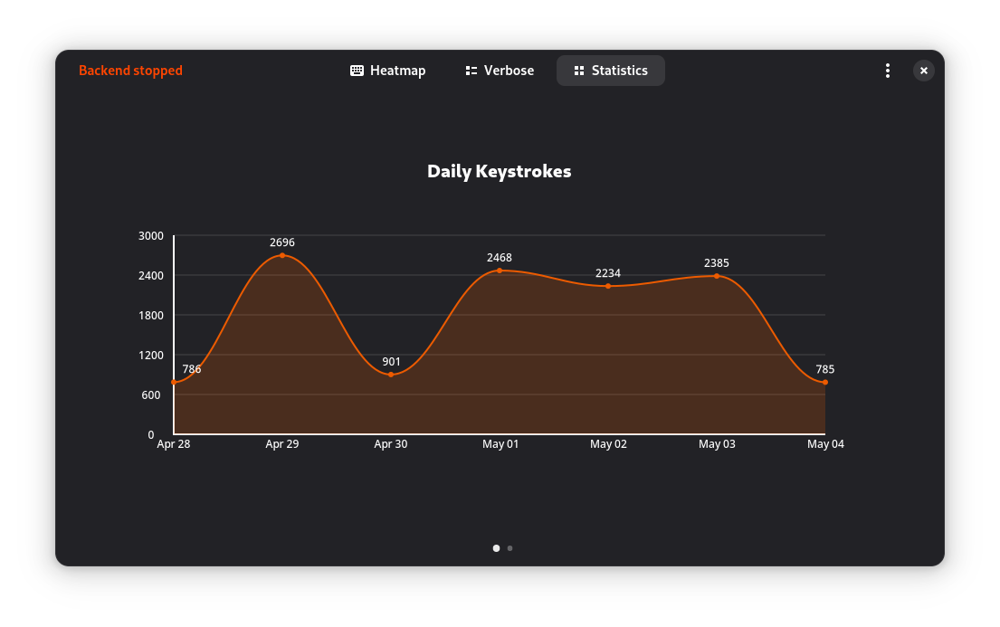

# TypeTrace


TypeTrace is an open-source application that tracks your keyboard input and
visualizes it through a heatmap and various charts. It provides insights into
typing behaviors, daily keystroke counts, and more. As a privacy-respecting
alternative to [WhatPulse](https://whatpulse.org/), TypeTrace ensures your data
is stored locally and under your control.

## Features

- **Keyboard Tracking**: Logs keystrokes locally with daily timestamps.
- **Visualizations**: Displays data via heatmaps and charts for intuitive analysis.
- **Privacy First**: Stores data in a local SQLite database, making it nearly impossible to reverse-engineer sensitive information like passwords.
- **Open Source**: Fully transparent codebase

## Screenshots

| Heatmap                             | Top Keystrokes                                    | Daily Keystrokes                                 |
| ----------------------------------- | ------------------------------------------------- | ------------------------------------------------ |
|  |  |  |

## Installation

TypeTrace can be installed on any Linux distribution using the following command:

```bash
curl --proto '=https' --tlsv1.2 -sSf https://raw.githubusercontent.com/domi413/TypeTrace/main/install.sh | bash
```

Note that:

- The script requires the following dependencies:

  - `curl`
  - `jq`
  - GNOME Shell 48 or later

- The local install requires the following dependencies:

  - `meson`
  - `ninja`
  - `pkg-config`

- Flatpak install requires the following dependencies:

  - `flatpak`
